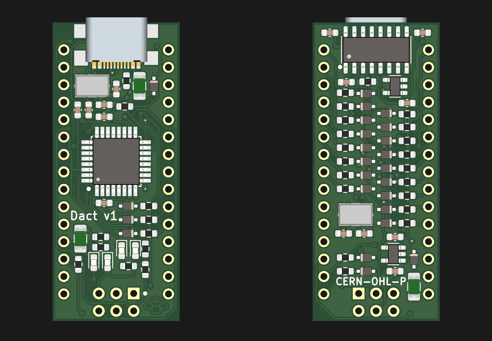

# Dact

With overcurrent(short) and overvoltage protection on all IO pins, VIN reverse polarity and short protection, USB and MCU overcurrent protection as well as reset pin overvoltage protection. And USB-C

Lacks 5 and 3V pin overvoltage protection, i tried but it wouldn't fit. Amazed i managed to fit this many features on it in general, and with 1608 components as well.

Of course there are tradeoffs, the onboard 5V regulator can only supply 150mA, there's no reset button and there's no way i could fit pin all identifiers, so i didn't add any.

The 220Ω resistors should ideally be 20ish mA polyfuses with 220Ω of built-in resistance.

Licensed under CERN-OHL-P